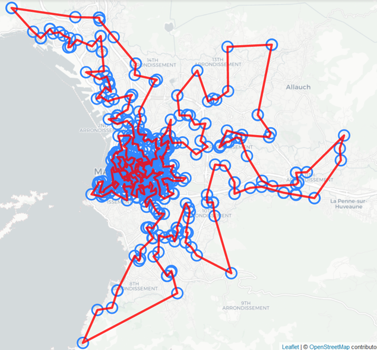
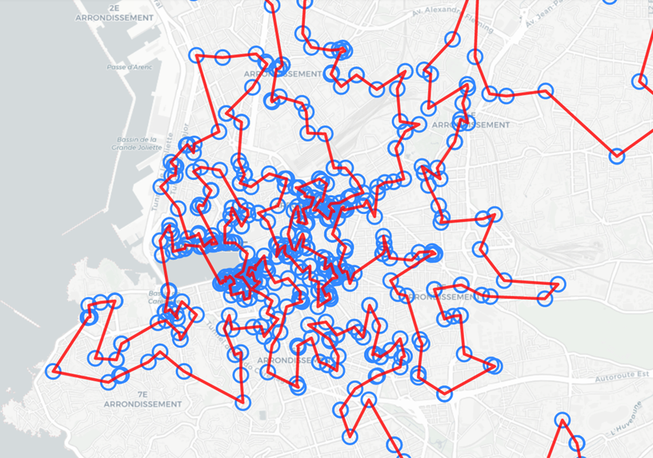

# Traveling Salesman Problem applied to Bars Crawls

In this notebook we explore the case of the _Travelling Salesman Problem_ (TSP).

This problem has been applied to finding the shortest route between pubs in UK.
See original article [here](https://www.math.uwaterloo.ca/tsp/uk/).

See also CACM article [here](https://cacm.acm.org/magazines/2022/1/257448-fifty-years-of-p-vs-np-and-the-possibility-of-the-impossible/fulltext).

## THe implemented process

* List of bars is collected from French INSEE Sirene database.
* GPS position is collected from OpenStreetMap using addresses from previous step.
* TSP 2 Opt algorithm is used to find the best route.
* Folium is used to display bars locations and the optimal route.

## Illustation for UK pubs

## Results for Marseille

The Sirene database provides 947 bars (_débits de boissons_). Using their addresses, only 771 places have been geolocated with OpenStreetMap.

The following map is obtained after running a 2-opt TSP solver:

Zooming on the center:

